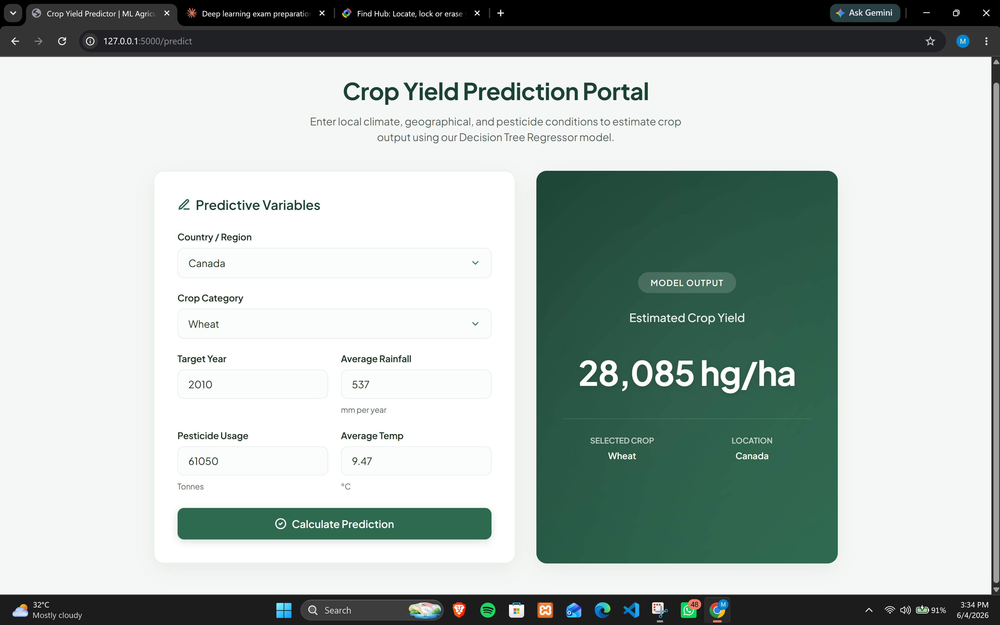
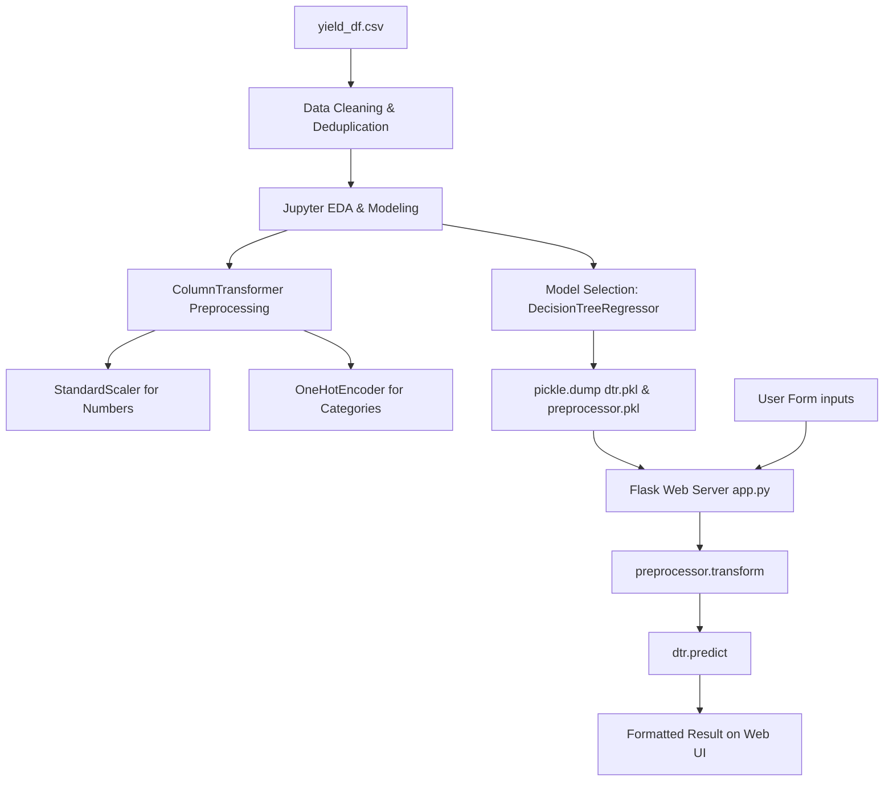

# Crop Yield Prediction Portal 🌾🚜

An end-to-end Machine Learning web application that predicts crop yields (hectograms per hectare - `hg/ha`) using climate indicators, pesticide volumes, crop categories, and geographic locations. 

Built with **Python**, **Scikit-Learn**, and **Flask**, this repository is designed as a template for production-ready ML engineering portfolio projects.

## 📷 Application Interface



---

## 🏗️ Architecture & Pipeline Flow

The project is structured with an offline training pipeline and an online inference web application:



---

## 🌟 Key Features

- **Robust Decision Tree Engine**: Uses an optimized Decision Tree Regressor achieving high accuracy ($R^2$) compared to baseline Linear, Lasso, and Ridge models.
- **Unified Preprocessing Pipeline**: Bundles custom feature scaling and categorical encoding into a single serialized `ColumnTransformer` object, ensuring no train-test data leakage.
- **Modern User Interface**: A responsive agricultural dashboard styled with a professional, organic green design (no generic purple AI aesthetics).
- **Dynamic Forms**: Auto-populated dropdown menus containing the exact $101$ countries and $10$ crops supported by the backend, preventing runtime value exceptions.
- **Server-Side Security**: Input validation and try-except error boundaries to gracefully catch exceptions without crashing the Flask instance.

---

## 📊 Model Evaluation Summary

From the offline analysis in [CropYield-Prediction.ipynb](CropYield-Prediction.ipynb), the models performed as follows on the evaluation split:

| Regression Model | Mean Absolute Error (MAE) | R² Score | Result |
| :--- | :---: | :---: | :---: |
| **Decision Tree Regressor** | **~4,000** | **~0.97** | **Selected (Best Performance)** |
| Ridge Regression | ~89,000 | ~0.74 | Baseline |
| Lasso Regression | ~89,000 | ~0.74 | Baseline |
| Linear Regression | ~89,000 | ~0.74 | Baseline |

---

## 🛠️ Tech Stack

* **Machine Learning & Analysis**: `scikit-learn`, `numpy`, `pandas`, `seaborn`, `matplotlib`
* **Web Service**: `Flask` (Python WSGI)
* **Frontend**: Vanilla CSS3, Semantic HTML5, Google Fonts (*Plus Jakarta Sans*)

---

## 🚀 Getting Started

Follow these instructions to run the application locally on your machine.

### Prerequisites

Make sure you have **Python 3.8+** installed.

### Installation

1. **Clone the repository**:
   ```bash
   git clone https://github.com/MShahBytes/Crop_Yield_Prediction.git
   cd Crop-Yield-Prediction
   ```

2. **Create and activate a virtual environment**:
   - **Windows (PowerShell)**:
     ```powershell
     python -m venv venv
     .\venv\Scripts\Activate.ps1
     ```
   - **Linux / macOS**:
     ```bash
     python3 -m venv venv
     source venv/bin/activate
     ```

3. **Install dependencies**:
   ```bash
   pip install -r requirements.txt
   ```

### Running the App

1. Start the Flask server:
   ```bash
   python app.py
   ```

2. Open your web browser and navigate to:
   ```
   http://127.0.0.1:5000
   ```
